# 🧵⚙️ گزارش پروژه پایانی درس پردازش موازی

# Parallel Processing Project : LU 1404-2


## 📌 اطلاعات کلی

| **نام پروژه** | Parallel Processing Project |
| ------------- | --------------------------- |
| **درس**       | پردازش موازی                |
| **دانشجو**    | سعید حق نظری                |
| **استاد**     | دکتر آرمین رشنو             |
| **دانشگاه**   | دانشگاه لرستان              |
| **ترم**       | بهار 1405                   |

---

## 📌 معرفی پروژه
پروژه **پردازش موازی** یک وب‌اپلیکیشن تعاملی برای آموزش و نمایش مفاهیم **همگام‌سازی(Synchronization)** در برنامه‌نویسی چندنخی و چندفرایندی است.
این پروژه با استفاده از **FastAPI** در بک‌اند و **HTML/CSS/JavaScript** در فرانت‌اند پیاده‌سازی شده است.

## 🎯 اهداف پروژه
1. **آموزش مفاهیم همگام‌سازی** در برنامه‌نویسی
2. **مقایسه ابزارهای مختلف** همگام‌سازی (Lock, RLock, Semaphore, ...)
3. **نمایش Race Condition** و روش‌های جلوگیری از آن
4. **شبیه‌سازی سناریوهای واقعی** مانند سیستم بانکی
5. **ایجاد یک محیط تعاملی** برای تست و یادگیری


## 📋 لیست کامل روش‌ها و ابزارهای همگام‌سازی

---
## 🧵 بخش اول: روش نخ (Thread-Based Parallelism)

### دسته اول: تعریف و مدیریت نخ

|شماره|ابزار|توضیح|
|---|---|---|
|1|**Defining a thread**|تعریف و ایجاد یک نخ ساده|
|2|**Determining the current thread**|تشخیص و نمایش نخ جاری|
|3|**Defining a thread subclass**|تعریف نخ با استفاده از زیرکلاس|

---

### دسته دوم: همگام‌سازی نخ (Synchronization)

|شماره|ابزار|توضیح|
|---|---|---|
|4|**Lock**|قفل ساده - دسترسی انحصاری به منابع|
|5|**RLock**|قفل قابل بازگشت (Reentrant Lock)|
|6|**Semaphore**|سمافور - کنترل تعداد دسترسی‌های همزمان|
|7|**Condition**|شرط - هماهنگی بر اساس رویدادها|
|8|**Event**|رویداد - علامت‌دهی بین نخ‌ها|
|9|**Barrier**|مانع - همگام‌سازی گروهی نخ‌ها|

---
### دسته سوم: ارتباط بین نخ‌ها

|شماره|ابزار|توضیح|
|---|---|---|
|10|**Queue**|صف - تبادل داده بین نخ‌ها|

---

### خلاصه ابزارهای نخ (Thread)

```text

Thread-Based Parallelism
├── Defining a thread
├── Determining the current thread
├── Defining a thread subclass
├── Thread synchronization with a lock
├── Thread synchronization with RLock
├── Thread synchronization with semaphores
├── Thread synchronization with a condition
├── Thread synchronization with an event
├── Thread synchronization with a barrier
└── Thread communication using a queue
```

---

## ⚙️ بخش دوم: روش فرایند (Process-Based Parallelism)

### دسته اول: ایجاد و مدیریت فرایند

|شماره|ابزار|توضیح|
|---|---|---|
|1|**Spawning a process**|ایجاد و اجرای یک فرایند جدید|
|2|**Naming a process**|نام‌گذاری فرایندها|
|3|**Running processes in the background**|اجرای فرایندها در پس‌زمینه|
|4|**Killing a process**|متوقف کردن (کشتن) یک فرایند|
|5|**Defining processes in a subclass**|تعریف فرایند در زیرکلاس|

---

### دسته دوم: ارتباط بین فرایندها

|شماره|ابزار|توضیح|
|---|---|---|
|6|**Using a queue to exchange data**|استفاده از صف برای تبادل داده|
|7|**Using pipes to exchange objects**|استفاده از پایپ برای تبادل اشیاء|

---

### دسته سوم: همگام‌سازی و مدیریت فرایند

|شماره|ابزار|توضیح|
|---|---|---|
|8|**Synchronizing processes**|همگام‌سازی فرایندها با قفل|
|9|**Using a process pool**|استفاده از استخر فرایند (Process Pool)|

---

### خلاصه ابزارهای فرایند (Process)

```text

Process-Based Parallelism
├── Spawning a process
├── Naming a process
├── Running processes in the background
├── Killing a process
├── Defining processes in a subclass
├── Using a queue to exchange data
├── Using pipes to exchange objects
├── Synchronizing processes
└── Using a process pool
```
---

## 📊 جدول مقایسه روش نخ و فرایند

| ویژگی          | نخ (Thread)                 | فرایند (Process)    |
| -------------- | --------------------------- | ------------------- |
| **حافظه**      | مشترک                       | جداگانه             |
| **ارتباط**     | آسان (از طریق حافظه مشترک)  | دشوار (نیاز به IPC) |
| **ایجاد**      | سریع و سبک                  | کند و سنگین         |
| **مناسب برای** | I/O-bound                   | CPU-bound           |
| **همگام‌سازی** | Lock, RLock, Semaphore, ... | Queue, Pipe, Lock   |

---

## 📚 ساختار پروژه

```tree
ParallelProcessingProject/
├── .venv/
├── app/
│   ├── __init__.py
│   ├── main.py
│   ├── registry.py
│   ├── thread/
│   │   ├── __init__.py
│   │   ├── lock.py
│   │   ├── rlock.py
│   │   ├── semaphore.py
│   │   ├── condition.py
│   │   ├── event.py
│   │   ├── barrier.py
│   │   ├── queue.py
│   │   ├── defining.py
│   │   ├── determining.py
│   │   └── subclass.py
│   │
│   └── process/
│       ├── __init__.py
│       ├── spawning.py
│       ├── naming.py
│       ├── background.py
│       ├── killing.py
│       ├── subclass.py
│       ├── queue.py
│       ├── pipes.py
│       ├── sync.py
│       └── pool.py
│
├── static/
│   ├── css/
│   │   └── style.css
│   └── js/
│       ├── script.js
│       ├── tools.js
│       └── scenarios.js
│
├── .gitignore
├── README.md
└── requirements.txt
```

## 🐋 فاز سوم: داکرایز کردن پروژه (Dockerization)

در این فاز، به‌منظور ایجاد یک محیط اجرای یکپارچه و مستقل از سیستم‌عامل میزبان، کل پروژه به همراه وب‌سرویس FastAPI داکرایز (Dockerized) شد. استفاده از Docker باعث می‌شود تمام وابستگی‌های نرم‌افزاری، نسخه Python و تنظیمات محیط اجرا در قالب یک Image استاندارد بسته‌بندی شوند و پروژه بدون نیاز به پیکربندی مجدد روی هر سیستم یا سرور لینوکسی اجرا گردد. همچنین اجرای پروژه در محیط لینوکسی Docker، بستری مناسب برای آزمایش و اجرای ابزارهای پردازش موازی مبتنی بر `multiprocessing` فراهم می‌کند.

### 🏗️ ساختار پیکربندی داکر

برای ساخت Image پروژه از نسخه سبک `python:3.12-slim` استفاده شد تا حجم نهایی Image کاهش یابد و زمان Build کوتاه‌تر شود. در Dockerfile ابتدا وابستگی‌های پروژه از طریق فایل `requirements.txt` نصب شده و سپس کد برنامه داخل Image کپی می‌شود. در نهایت، وب‌سرور ASGI یعنی **Uvicorn** به عنوان نقطه شروع (Entrypoint) کانتینر اجرا شده و درخواست‌های HTTP را روی پورت `8000` دریافت می‌کند.

### 🚀 دستورات راه‌اندازی و ساخت کانتینر

برای ساخت Image پروژه بر اساس Dockerfile و اجرای کانتینر در حالت Detached از دستور زیر استفاده شد:

```bash
docker compose up --build -d
```

**خروجی:**
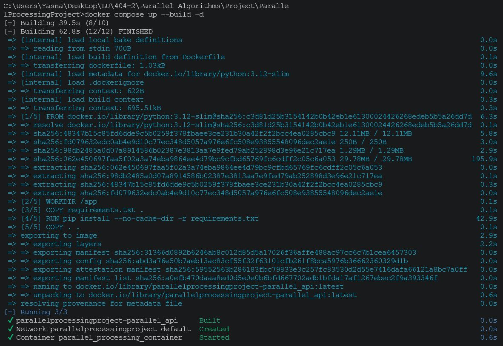

✅ بررسی صحت اجرای کانتینر

پس از بالا آمدن کانتینر، برای اطمینان از سالم بودن اجرای آن، وضعیت کانتینرهای در حال اجرا بررسی شد:

```bash
docker ps
```

همان‌طور که در تصویر زیر مشخص است، کانتینر `parallel_processing_container` با وضعیت `Up` در حال اجراست و پورت `8000` آن به‌درستی به سیستم میزبان نگاشت (Map) شده است. در خروجی دستور `docker ps` ستون **STATUS** نشان‌دهنده وضعیت اجرای کانتینر، ستون **PORTS** بیانگر نگاشت پورت‌های کانتینر به سیستم میزبان و ستون **NAMES** نام کانتینر در حال اجرا را نمایش می‌دهد.

خروجی:
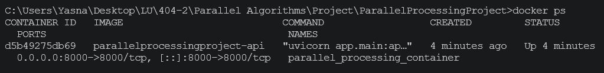

---

📜 مشاهده لاگ‌های زنده Uvicorn

برای اطمینان از این‌که وب‌سرور Uvicorn داخل کانتینر بدون خطا بالا آمده و آماده پذیرش درخواست است، لاگ‌های زنده کانتینر بررسی شد:

```bash
docker compose logs -f
```

> وجود پیام‌های زیر نشان می‌دهد که برنامه بدون خطا مقداردهی اولیه شده و وب‌سرور آماده پاسخ‌گویی به درخواست‌های HTTP است:

- Application startup complete
- Uvicorn running on [http://0.0.0.0:8000](http://0.0.0.0:8000)
خروجی:
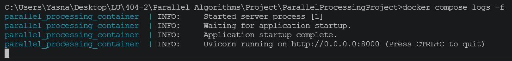

---

🌐 تست دسترسی از مرورگر

در نهایت، صحت عملکرد کامل وب‌سرویس (شامل بارگذاری صفحه اصلی، فایل‌های استاتیک CSS و JavaScript، و اتصال صحیح به API) از طریق مرورگر روی آدرس `http://localhost:8000` بررسی شد.
در این مرحله علاوه بر نمایش صفحه اصلی، فایل‌های استاتیک پروژه (CSS و JavaScript) نیز بدون خطا بارگذاری شدند و ارتباط صحیح رابط کاربری با APIهای پیاده‌سازی‌شده در FastAPI مورد بررسی قرار گرفت.

خروجی:
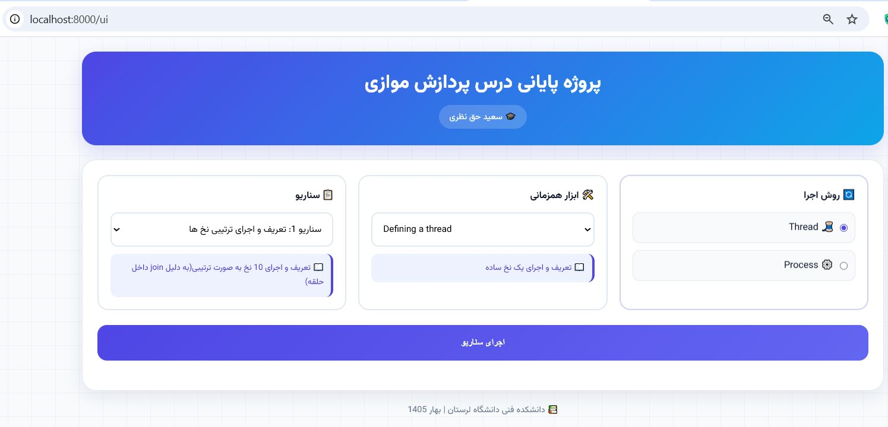

---

📄 جمع‌بندی فاز سوم

در پایان این فاز، پروژه با موفقیت در قالب یک Docker Image مستقل بسته‌بندی شد. این Image شامل تمامی وابستگی‌های نرم‌افزاری، کد برنامه، فایل‌های استاتیک و تنظیمات موردنیاز برای اجرای وب‌سرویس است. با اجرای این Image در قالب کانتینر، پروژه بدون وابستگی به محیط سیستم‌عامل میزبان اجرا می‌شود و امکان استقرار آسان آن روی هر سرور لینوکسی فراهم خواهد شد. این موضوع علاوه بر افزایش قابلیت حمل (Portability)، فرآیند توسعه، آزمون و استقرار نهایی پروژه را نیز ساده‌تر می‌کند.

## فایل‌های ایجاد شده در این فاز

|فایل|وظیفه|
|---|---|
|Dockerfile|ساخت Image پروژه|
|docker-compose.yml|مدیریت اجرای کانتینرها|
|requirements.txt|وابستگی‌های پایتون|
|.dockerignore|جلوگیری از کپی فایل‌های غیرضروری داخل Image|

# 🌐 فاز چهارم: بارگذاری پروژه در GitHub (Version Control & Repository)

در این فاز، پس از تکمیل داکرایز کردن پروژه، کلیه فایل‌های پروژه در یک مخزن(Repository) در GitHub بارگذاری شدند. استفاده از GitHub علاوه بر نگهداری نسخه‌های مختلف پروژه، امکان توسعه گروهی، مدیریت تغییرات، تهیه نسخه پشتیبان و استقرار(Deployment) پروژه روی سرور را فراهم می‌کند.

در این پروژه، فایل‌های مربوط به برنامه FastAPI، فایل‌های Docker، تنظیمات پروژه و سایر منابع موردنیاز همگی در قالب یک مخزن Git مدیریت شدند.

---

## 🏗️ ایجاد Repository در GitHub

ابتدا یک Repository جدید در حساب GitHub ایجاد شد تا تمام فایل‌های پروژه در آن نگهداری شوند.

در زمان ایجاد Repository، گزینه **Public Repository** انتخاب شد تا پروژه به صورت عمومی در دسترس باشد.

**خروجی:**
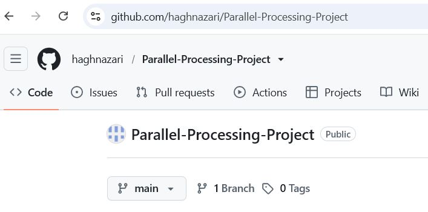
---

## 🔗 اتصال پروژه محلی به Repository

پس از ایجاد Repository، پروژه محلی که در محیط توسعه (IDE) قرار داشت به مخزن Git متصل شد.

ابتدا در صورت نیاز، مخزن Git در پوشه پروژه مقداردهی اولیه گردید:

```
git init
```

سپس آدرس Repository به عنوان مخزن راه‌دور (Remote Repository) ثبت شد:

```
git remote add origin https://github.com/haghnazari/Parallel-Processing-Project.git
```

برای اطمینان از صحت اتصال، فهرست مخزن‌های راه‌دور بررسی شد:

```
git remote -v
```

---

## 📦 ثبت تغییرات پروژه (Commit)

پس از اتصال پروژه به GitHub، تمامی فایل‌های پروژه به ناحیه Stage اضافه شدند:

```
git add .
```

سپس اولین نسخه پروژه با یک پیام مناسب ثبت (Commit) شد:

```
git commit -m "Initial Dockerized Parallel Processing Project"
```

عملیات Commit باعث می‌شود یک Snapshot از وضعیت فعلی پروژه در تاریخچه Git ذخیره شود.

---

## 🚀 ارسال پروژه به GitHub

در مرحله بعد، نسخه ثبت‌شده پروژه به مخزن GitHub ارسال شد.

```
git push -u origin main
```

در اولین Push، شاخه محلی (**main**) به شاخه متناظر در GitHub متصل شد و از این پس تنها با دستور زیر می‌توان تغییرات بعدی را ارسال کرد:

```
git push
```


---

## 🌐 بررسی Repository

پس از پایان عملیات Push، مخزن GitHub بررسی شد تا از بارگذاری صحیح فایل‌ها اطمینان حاصل شود.

در این مرحله فایل‌های پروژه شامل:

- سورس کد FastAPI
- فایل‌های Docker
- فایل‌های Static
- فایل README
- تنظیمات پروژه

در Repository قابل مشاهده هستند.

**خروجی:**
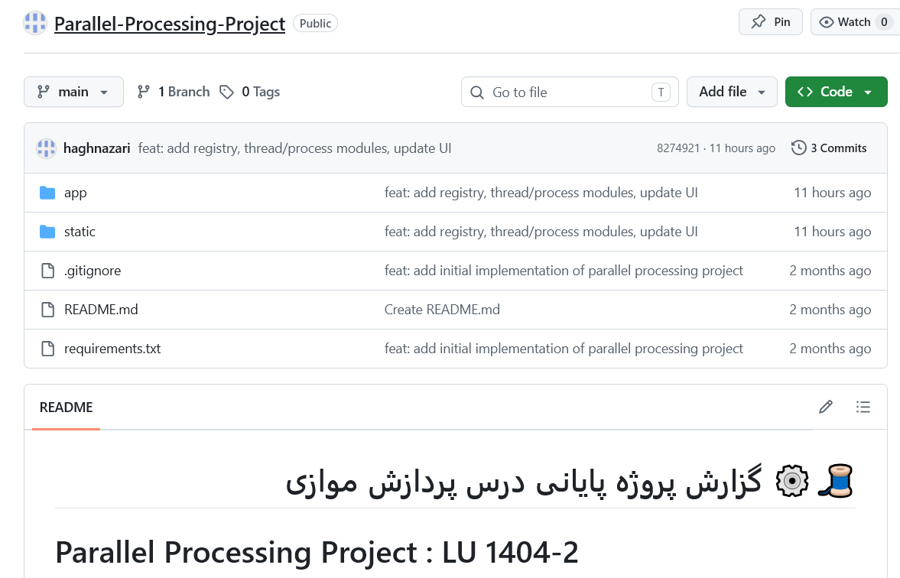

---

## 📄 جمع‌بندی فاز چهارم

در پایان این فاز، پروژه با موفقیت در GitHub منتشر شد و تمامی فایل‌های موردنیاز در قالب یک Repository عمومی در دسترس قرار گرفتند. استفاده از Git و GitHub امکان مدیریت نسخه‌های مختلف پروژه، ثبت تاریخچه تغییرات، همکاری تیمی و استقرار آسان پروژه روی سرور را فراهم می‌کند. همچنین در مراحل بعدی، سرور لینوکسی می‌تواند مستقیماً پروژه را از همین Repository دریافت (Clone) کرده و به‌روزرسانی‌های بعدی نیز تنها با اجرای دستور `git pull` اعمال شوند.

***دستورات مهم گیت***

| دستور                   | کاربرد                                     |
| ----------------------- | ------------------------------------------ |
| `git init`              | ایجاد مخزن محلی Git                        |
| `git remote add origin` | اتصال پروژه به GitHub                      |
| `git add .`             | اضافه کردن فایل‌ها به Stage                |
| `git commit`            | ثبت یک نسخه از پروژه                       |
| `git push`              | ارسال تغییرات به GitHub                    |
| `git pull`              | دریافت آخرین تغییرات از Repository         |
| `git branch -M main`    | تغییر نام شاخه پیش‌فرض به main             |
| `git status`            | نمایش وضعیت فایل‌های Stage‌نشده/تغییریافته |


# 🖥️ فاز پنجم: تهیه سرور مجازی و نصب نیازمندی‌ها (VPS Setup)

در این فاز، جهت استقرار (Deployment) نهایی پروژه، یک سرور مجازی لینوکسی (VPS) از سرویس ابری **پارس‌پک** تهیه و پیکربندی شد. این سرور به‌عنوان محیط اجرای نهایی و عمومی وب‌سرویس FastAPI داکرایز‌شده استفاده خواهد شد.

---

## 🛒 تهیه سرور ابری از پارس‌پک

سروری با مشخصات زیر از پنل پارس‌پک خریداری شد:

| مشخصه | مقدار |
|---|---|
| موقعیت جغرافیایی | تهران |
| سیستم‌عامل | Ubuntu 24.04 |
| پلن | irCloud3 |
| RAM | 2 GB |
| CPU | 2 Core |
| Storage | 50 GB |
| آدرس IP | `185.252.86.140` |

**خروجی:**
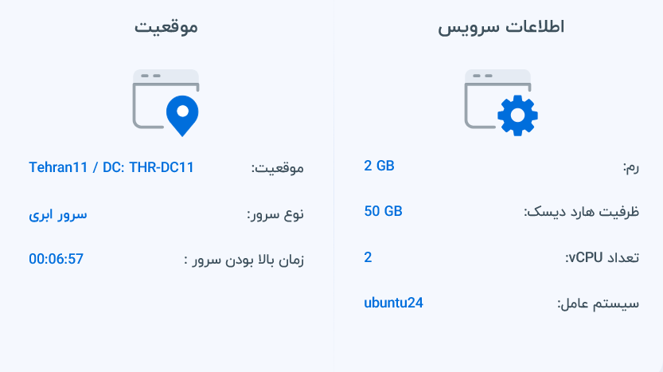

---

## 🔐 اتصال به سرور از طریق SSH

برای دسترسی به سرور، از پروتکل SSH استفاده شد:

```bash
ssh root@185.252.86.140
```

پس از وارد کردن رمز عبور ارسالی توسط پارس‌پک، اتصال با موفقیت برقرار شد.

**خروجی:**
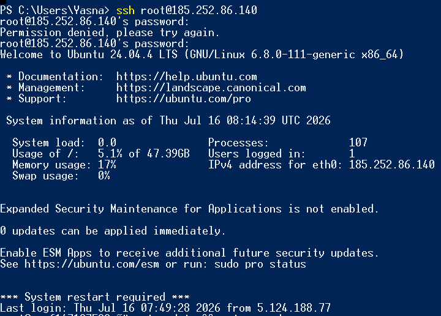

---

## 🔄 به‌روزرسانی سیستم‌عامل

پیش از نصب هرگونه نیازمندی، بسته‌های سیستم‌عامل به‌روزرسانی شدند:

```bash
apt update && apt upgrade -y
```

**خروجی:**
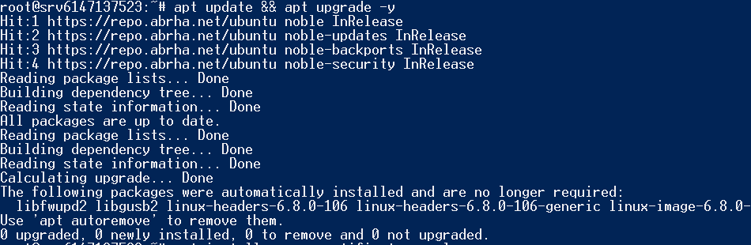

---

## 🐋 نصب Docker Engine و Docker Compose

با استفاده از اسکریپت نصب رسمی داکر، Docker Engine به همراه پلاگین Docker Compose نصب شد:

```bash
apt install -y ca-certificates curl gnupg
curl -fsSL https://get.docker.com -o get-docker.sh
sh get-docker.sh
```

برای اطمینان از نصب صحیح، نسخه هر دو ابزار بررسی شد:

```bash
docker --version
docker compose version
```

همچنین فعال بودن سرویس Docker روی سیستم‌عامل بررسی شد:

```bash
systemctl status docker
```

**خروجی:**
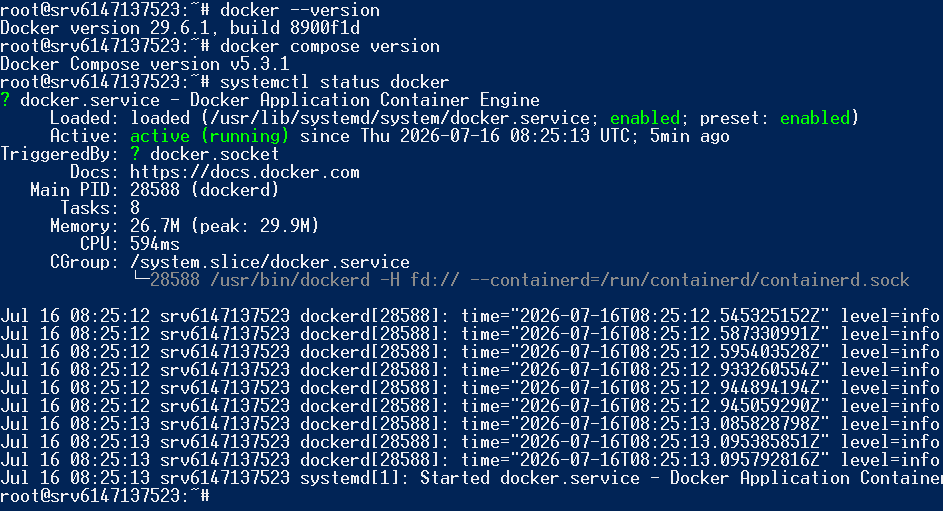

---

## 📥 نصب Git و دریافت پروژه از GitHub

Git روی سرور نصب و نسخه آن بررسی شد:

```bash
apt install -y git
git --version
```

سپس پروژه مستقیماً از مخزن GitHub روی سرور Clone شد:

```bash
git clone https://github.com/haghnazari/Parallel-Processing-Project.git
cd Parallel-Processing-Project
```

**خروجی:**
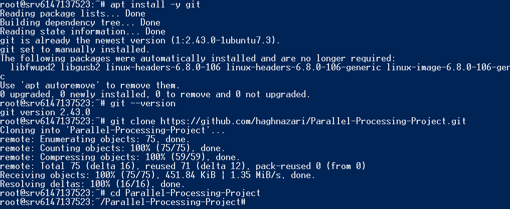

---

## 🚀 ساخت و اجرای کانتینر روی سرور

با استفاده از فایل‌های Docker موجود در پروژه، Image ساخته شد و کانتینر به صورت پس‌زمینه اجرا گردید:

```bash
docker compose up --build -d
```

بررسی وضعیت کانتینر:

```bash
docker ps
```

خروجی نشان می‌دهد کانتینر `parallel_processing_container` با وضعیت `Up` روی سرور در حال اجراست.

**خروجی:**
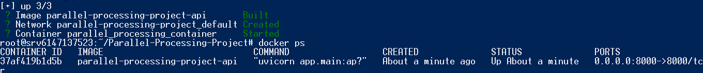

---

## 🔥 تنظیم فایروال (UFW)

برای دسترسی موقت به وب‌سرویس از طریق پورت ۸۰۰۰ (پیش از راه‌اندازی Nginx در فاز بعد)، قوانین فایروال به شرح زیر تنظیم شد:

```bash
ufw allow OpenSSH
ufw allow 8000/tcp
ufw enable
```

**خروجی:**


### ⚠️ نکته فنی — لغو فعال‌سازی UFW

در اجرای دستور `ufw enable`، سیستم هشدار زیر را نمایش داد:

```
Command may disrupt existing ssh connections. Proceed with operation (y|n)? y  
Aborted
```
با وجود تأیید (`y`)، عملیات با پیام `Aborted` متوقف شد و بررسی وضعیت با دستور `ufw status` مقدار `inactive` را نشان داد. این موضوع به این معناست که **فایروال UFW در این مرحله غیرفعال باقی مانده** و عملاً هیچ پورتی توسط آن مسدود یا کنترل نمی‌شود؛ به همین دلیل نیز دسترسی از طریق مرورگر بدون مشکل برقرار شد (چون هیچ قانون فایروالی مانع آن نبوده است).

این مسئله در فاز بعدی (راه‌اندازی Nginx)، هم‌زمان با تنظیم Reverse Proxy، مجدداً بررسی و در صورت نیاز با فعال‌سازی صحیح UFW یا استفاده از فایروال پیش‌فرض ارائه‌دهنده (پارس‌پک) کنترل دسترسی به پورت‌ها به‌درستی اعمال خواهد شد.

---

## 🌐 تست دسترسی عمومی از طریق IP سرور

در نهایت، صحت اجرای وب‌سرویس از طریق مرورگر و با استفاده از آدرس IP عمومی سرور بررسی شد:

```
http://185.252.86.140:8000/ui
```

پروژه به‌درستی بارگذاری شد و صفحه اصلی همراه با فایل‌های استاتیک (CSS/JS) به نمایش درآمد.

**خروجی:**
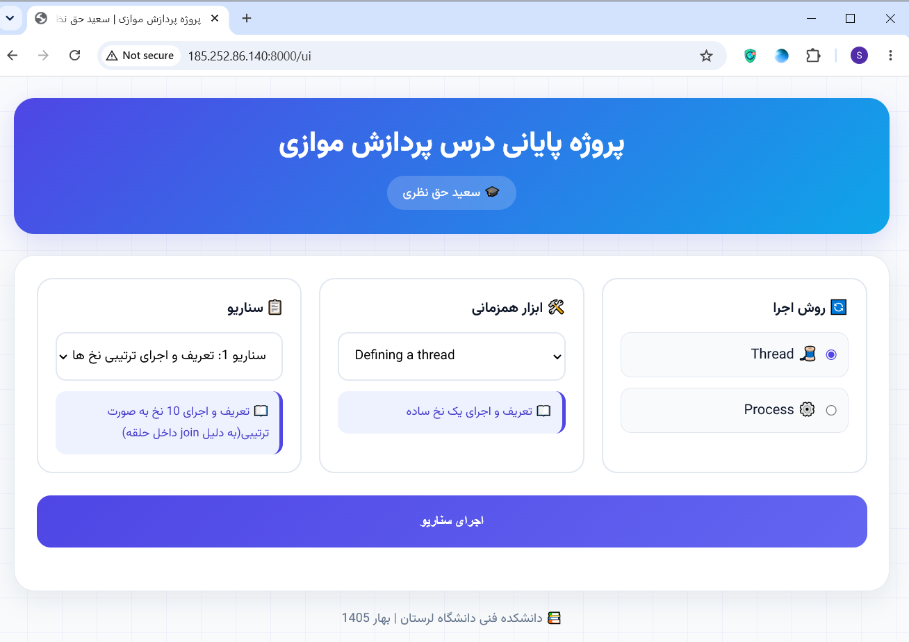

---

## 📄 جمع‌بندی فاز پنجم

در پایان این فاز، یک سرور مجازی لینوکسی از پارس‌پک با سیستم‌عامل Ubuntu 24.04 تهیه و پیکربندی شد. نیازمندی‌های اصلی شامل Docker Engine، Docker Compose و Git روی آن نصب گردید. پروژه مستقیماً از مخزن GitHub بر روی سرور Clone و با استفاده از Docker Compose اجرا شد. در نهایت، دسترسی عمومی به وب‌سرویس از طریق آدرس IP سرور با موفقیت تست شد.

نکته قابل‌توجه این فاز، عدم فعال‌سازی موفق فایروال UFW بود که در فاز ششم (پیکربندی Nginx) به همراه تنظیمات امنیتی نهایی (مانند بستن دسترسی مستقیم به پورت ۸۰۰۰ و باز کردن صرفاً پورت‌های ۸۰ و ۴۴۳) مورد بازبینی قرار خواهد گرفت.

***دستورات مهم این فاز:***

| دستور | کاربرد |
|---|---|
| `ssh root@<IP>` | اتصال به سرور از طریق SSH |
| `apt update && apt upgrade -y` | به‌روزرسانی بسته‌های سیستم‌عامل |
| `curl -fsSL https://get.docker.com -o get-docker.sh` | دانلود اسکریپت نصب Docker |
| `sh get-docker.sh` | اجرای نصب Docker Engine |
| `systemctl status docker` | بررسی وضعیت سرویس Docker |
| `git clone <repo-url>` | دریافت پروژه از GitHub |
| `docker compose up --build -d` | ساخت و اجرای کانتینر در پس‌زمینه |
| `ufw allow <port>/tcp` | باز کردن پورت مشخص در فایروال |
| `ufw enable` | فعال‌سازی فایروال UFW |
| `ufw status` | بررسی وضعیت فایروال |

***کاربرد برخی دستورات:***

|دستور|معنی|کاربرد|
|---|---|---|
|`ssh`|اتصال امن به سرور|ورود به سرور|
|`apt update`|به‌روزرسانی لیست بسته‌ها|دیدن نسخه‌های جدید|
|`apt upgrade -y`|نصب به‌روزرسانی‌ها|آپدیت نرم‌افزارها|
|`curl`|دانلود فایل از اینترنت|دریافت اسکریپت داکر|
|`sh`|اجرای اسکریپت|نصب داکر|
|`apt install`|نصب بسته‌های جدید|نصب Git, Nginx|
|`-y`|تأیید خودکار|پاسخ "بله" به سوالات|


# 🌐 فاز ششم: پیکربندی Nginx و راه‌اندازی Reverse Proxy

در این فاز، وب‌سرور **Nginx** به عنوان **Reverse Proxy** در مقابل وب‌سرویس FastAPI قرار گرفت. در این معماری، کاربران درخواست‌های خود را به Nginx ارسال می‌کنند و Nginx آن‌ها را به سرویس Uvicorn که داخل کانتینر Docker و روی پورت `8000` اجرا می‌شود هدایت می‌کند.

استفاده از Reverse Proxy علاوه بر افزایش امنیت، امکان مدیریت دامنه، فعال‌سازی HTTPS، ارائه فایل‌های استاتیک، مدیریت بار (Load Balancing) و توسعه آسان‌تر سرویس را فراهم می‌کند.

---

# 📦 نصب Nginx

ابتدا وب‌سرور Nginx روی سرور نصب شد.

```
apt install nginx -y
```

پس از پایان نصب، نسخه Nginx بررسی گردید.

```
nginx -v
```

همچنین وضعیت سرویس نیز کنترل شد.

```
systemctl status nginx
```

**خروجی:**


---

# ⚙️ ایجاد فایل پیکربندی سایت

برای جلوگیری از تغییر فایل اصلی Nginx، یک فایل تنظیمات اختصاصی برای پروژه ایجاد شد.

```
nano /etc/nginx/sites-available/parallel-processing
```

محتوای فایل:

```
server {

    listen 80;

    server_name saeedhaghnazari.ir www.saeedhaghnazari.ir;

    location / {

        proxy_pass http://127.0.0.1:8000;

        proxy_set_header Host $host;

        proxy_set_header X-Real-IP $remote_addr;

        proxy_set_header X-Forwarded-For $proxy_add_x_forwarded_for;

        proxy_set_header X-Forwarded-Proto $scheme;

    }

}
```

در این تنظیمات، تمامی درخواست‌های کاربران به سرویس FastAPI که داخل کانتینر Docker روی پورت `8000` اجرا می‌شود ارسال خواهد شد.

**خروجی:**

## 📝 توضیح کامل فایل تنظیمات Nginx

| خط                                         | توضیح                                                      |
| ------------------------------------------ | ---------------------------------------------------------- |
| `listen 80;`                               | گوش دادن به درخواست‌های HTTP روی پورت ۸۰ (پورت پیش‌فرض وب) |
| `server_name saeedhaghnazari.ir;`          | دامنه‌ای که این تنظیمات برای آن اعمال می‌شود               |
| `location / {`                             | همه درخواست‌های اصلی (مثل `/ui` یا `/api/...`)             |
| `proxy_pass http://localhost:8000;`        | هدایت درخواست‌ها به FastAPI روی پورت ۸۰۰۰                  |
| `proxy_set_header Host $host;`             | ارسال دامنه اصلی به FastAPI                                |
| `proxy_set_header X-Real-IP $remote_addr;` | ارسال آی‌پی واقعی کاربر                                    |

---

# 🔗 فعال‌سازی سایت

پس از ایجاد فایل تنظیمات، با استفاده از Symbolic Link، سایت در Nginx فعال شد.

```
ln -s /etc/nginx/sites-available/parallel-processing \
      /etc/nginx/sites-enabled/
```

در صورت وجود فایل پیش‌فرض، آن حذف شد.

```
rm /etc/nginx/sites-enabled/default
```

---

# ✅ بررسی صحت تنظیمات

قبل از راه‌اندازی مجدد سرویس، فایل تنظیمات توسط Nginx اعتبارسنجی شد.

```
nginx -t
```

پیغام

```
syntax is ok
test is successful
```

نشان می‌دهد که فایل پیکربندی بدون هیچ خطای نحوی آماده اجرا است.

**خروجی:**
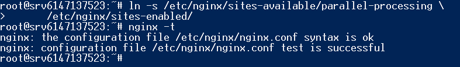
---

# 🔄 راه‌اندازی مجدد Nginx

پس از تأیید تنظیمات، سرویس Nginx مجدداً راه‌اندازی شد.

```
systemctl restart nginx
```

و وضعیت آن بررسی گردید.

```
systemctl status nginx
```


---

# 🔥 تنظیم فایروال

پس از فعال شدن Nginx، دیگر نیازی به دسترسی مستقیم کاربران به پورت `8000` نبود.

بنابراین تنها پورت‌های استاندارد وب باز شدند.

```
ufw allow 80/tcp

ufw allow 443/tcp
```

در ادامه وضعیت قوانین بررسی شد.

```
ufw status
```

> در این معماری، کاربران فقط به پورت‌های **80** و **443** دسترسی خواهند داشت و ارتباط با سرویس FastAPI صرفاً از طریق Reverse Proxy انجام می‌شود.

**خروجی:**
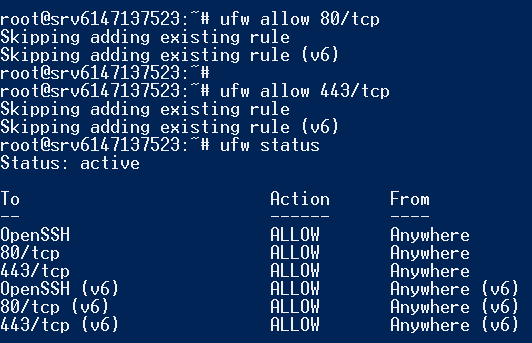
---

# 🌍 تست عملکرد Reverse Proxy

در پایان، عملکرد صحیح Reverse Proxy بررسی شد.

ابتدا با دستور زیر پاسخ سرور کنترل گردید.

```
curl http://185.252.86.140
```

سپس وب‌سایت از طریق مرورگر باز شد.

```
http://185.252.86.140
```

تمام درخواست‌ها با موفقیت توسط Nginx دریافت و به سرویس FastAPI منتقل شدند و صفحات پروژه بدون نیاز به مشخص کردن پورت `8000` بارگذاری گردیدند.

**خروجی:**
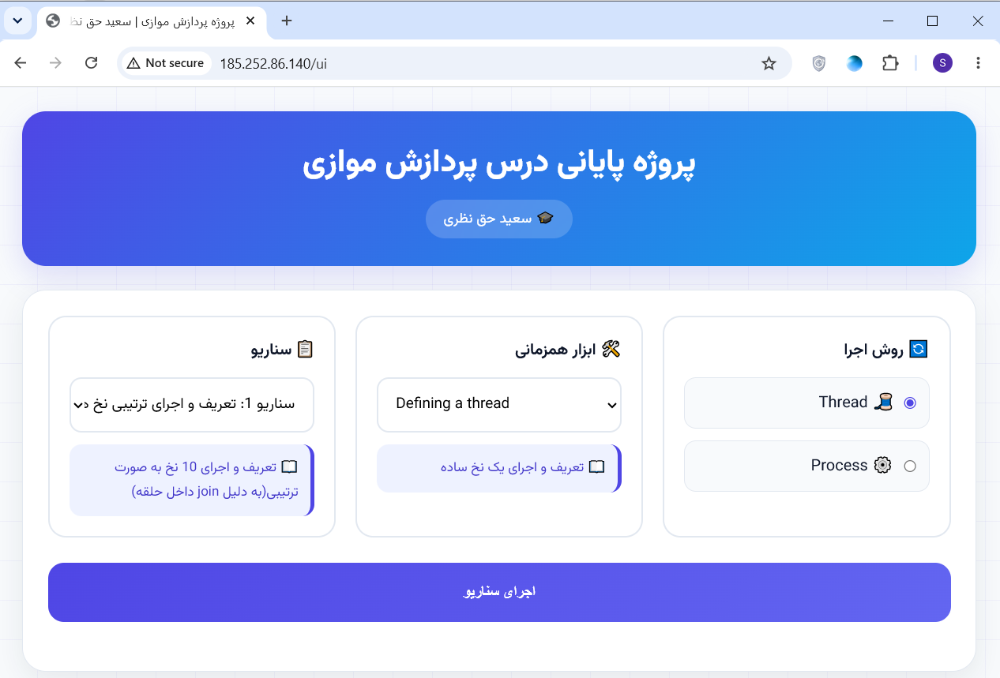
---

# 📄 جمع‌بندی فاز ششم

در این فاز، وب‌سرور Nginx با موفقیت روی سرور لینوکسی نصب و به عنوان Reverse Proxy در مقابل سرویس FastAPI پیکربندی شد. با این معماری، کاربران دیگر مستقیماً به سرویس Uvicorn متصل نمی‌شوند و تمامی درخواست‌ها ابتدا توسط Nginx دریافت و سپس به کانتینر Docker هدایت می‌شوند. این ساختار علاوه بر افزایش امنیت، مدیریت دامنه، راه‌اندازی HTTPS، کنترل دسترسی و توسعه آینده سامانه را ساده‌تر می‌کند.

در پایان، عملکرد صحیح Reverse Proxy با موفقیت آزمایش شد و وب‌سرویس از طریق آدرس عمومی سرور بدون نیاز به مشخص کردن شماره پورت در دسترس قرار گرفت.

---

## 📌 مفهوم معماری نهایی

```
                 Internet
                     │
                     ▼
        http://saeedhaghnazari.ir
                     │
                     ▼
              Nginx (Port 80)
                     │
             Reverse Proxy
                     │
                     ▼
         FastAPI + Uvicorn (Port 8000)
                     │
                     ▼
              Docker Container
```

---

## 📋 دستورات مهم این فاز

|دستور|کاربرد|
|---|---|
|`apt install nginx -y`|نصب Nginx|
|`nginx -v`|بررسی نسخه Nginx|
|`systemctl status nginx`|بررسی وضعیت سرویس|
|`nano /etc/nginx/sites-available/parallel-processing`|ایجاد فایل تنظیمات سایت|
|`ln -s ...`|فعال‌سازی سایت|
|`rm /etc/nginx/sites-enabled/default`|حذف سایت پیش‌فرض|
|`nginx -t`|بررسی صحت تنظیمات|
|`systemctl restart nginx`|راه‌اندازی مجدد سرویس|
|`ufw allow 80/tcp`|باز کردن پورت HTTP|
|`ufw allow 443/tcp`|باز کردن پورت HTTPS|
|`curl http://185.252.86.140`|تست عملکرد Reverse Proxy|


# 🌐 فاز هفتم: اتصال دامنه به سرور از طریق Cloudflare

در این فاز، دامنه **saeedhaghnazari.ir** که قبلاً ثبت شده بود، به سرویس Cloudflare متصل شد تا علاوه بر مدیریت DNS، امکاناتی مانند Reverse Proxy، SSL رایگان، افزایش امنیت و بهبود عملکرد وب‌سایت نیز فراهم شود.

در نهایت، دامنه به آدرس IP سرور مجازی متصل شد تا کاربران بتوانند بدون وارد کردن IP و تنها با نام دامنه به پروژه دسترسی داشته باشند.

---

## ☁️ افزودن دامنه به Cloudflare

ابتدا وارد پنل Cloudflare شده و گزینه **Add a Site** انتخاب شد.

دامنه زیر به Cloudflare اضافه گردید:

```
saeedhaghnazari.ir
```

سپس پلن **Free** انتخاب شد.

**خروجی:**


---

## 🔄 دریافت Name Server های Cloudflare

پس از اضافه شدن دامنه، Cloudflare دو Name Server اختصاصی نمایش داد.

این Name Serverها باید در پنل ثبت‌کننده دامنه(ایرنیک) تنظیم شوند.

**خروجی:**


---

## 🌍 تغییر Name Server در پنل ثبت دامنه

از آنجا که دامنه قبلاً ثبت شده بود، وارد پنل مدیریت دامنه شده و Name Serverهای پیش‌فرض با Name Serverهای ارائه شده توسط Cloudflare جایگزین شدند.

پس از ذخیره تغییرات، انتشار DNS چند دقیقه تا چند ساعت زمان برد.

**خروجی:**

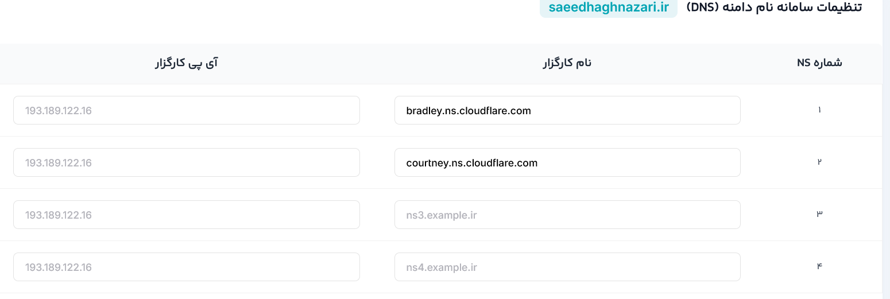

---

## 📡 ایجاد رکوردهای DNS

پس از فعال شدن دامنه در Cloudflare، رکوردهای DNS ایجاد شدند.

| Type | Name | Value |
|------|------|--------|
| A | @ | 185.252.86.140 |
| A | www | 185.252.86.140 |

هر دو رکورد در حالت **Proxied** (ابر نارنجی) قرار گرفتند تا ترافیک ابتدا از Cloudflare عبور کند.

**خروجی:**


---

## 🔒 فعال‌سازی SSL

برای برقراری ارتباط امن HTTPS تنظیمات SSL در Cloudflare انجام شد.

تنظیمات به صورت زیر انتخاب شدند:

```
SSL Mode : Full
Always Use HTTPS : Enabled
Automatic HTTPS Rewrites : Enabled
```

این تنظیمات باعث می‌شوند تمام درخواست‌های HTTP به HTTPS هدایت شوند.

---

## 🌐 بررسی اتصال دامنه

پس از انتشار رکوردهای DNS، دامنه به سرور متصل شد.

ابتدا با دستور زیر پاسخ سرور بررسی شد:

```bash
ping saeedhaghnazari.ir
```

**خروجی:**
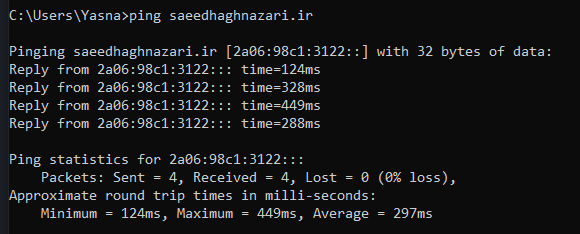

سپس پاسخ HTTP نیز بررسی گردید:

```bash
curl https://saeedhaghnazari.ir
```

در نهایت پروژه از طریق مرورگر قابل دسترس شد.

و رابط کاربری نیز در آدرس زیر در دسترس قرار گرفت:

```
https://saeedhaghnazari.ir/ui
```

**خروجی:**

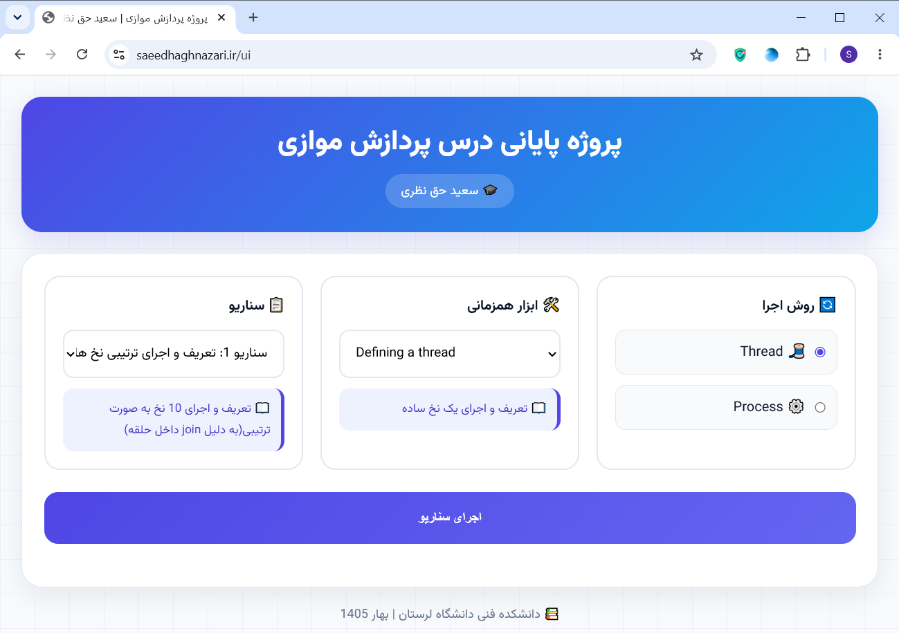

---

# 📄 جمع‌بندی فاز هفتم

در پایان این فاز، دامنه **saeedhaghnazari.ir** با موفقیت به Cloudflare متصل شد و رکوردهای DNS به آدرس IP سرور مجازی اشاره داده شدند. همچنین با فعال‌سازی قابلیت‌های SSL و Reverse Proxy، ارتباط کاربران با وب‌سرویس از طریق پروتکل HTTPS برقرار شد.

در نتیجه، پروژه از طریق یک دامنه عمومی، امن و قابل دسترس در اینترنت منتشر گردید و بدون نیاز به استفاده از آدرس IP مستقیماً قابل استفاده است.

---

## 📌 دستورات مهم این فاز

| دستور | کاربرد |
|--------|---------|
| `ping saeedhaghnazari.ir` | بررسی Resolve شدن دامنه |
| `nslookup saeedhaghnazari.ir` | مشاهده IP ثبت شده برای دامنه |
| `curl http://saeedhaghnazari.ir` | بررسی پاسخ HTTP |
| `curl https://saeedhaghnazari.ir` | بررسی پاسخ HTTPS |
| `dig saeedhaghnazari.ir` | بررسی وضعیت رکوردهای DNS |


